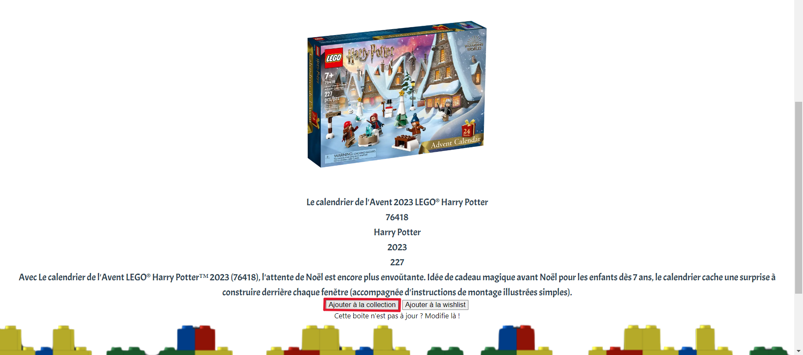
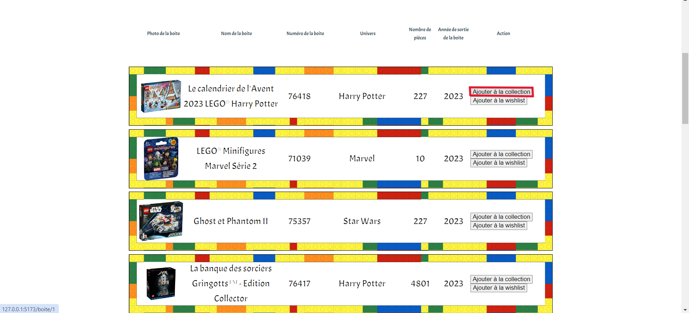

# Ajouter une boîte dans votre Collection sur notre site

Une fois connecté, vous pouvez gérer votre collection en ajoutant des éléments dans celle-ci. Celle-ci est visible dans vôtre Collection, elle se trouve dans le menu droit en cliquant sur le bouton "**Collection**".

## Comment ajouter une boîte dans la Collection ?

<!--  -->

- Légende : Bouton permettant d'ajouter une collection sur la page d'une boîte

<!--  -->

- Légende : Bouton permettant d'ajouter une collection sur la liste de recherche de boîte

Pour pouvoir ajouter une boîte dans la Collection, il faut se rendre dans **la page d'une boîte** que l'on veut ajouter ou sur la page **Recherche Boite** qui se trouve dans le menu gauche du site. Ensuite, il faut cliquer sur le bouton "**Ajouter dans la Collection**."

## Près requis avant votre ajout d'une boîte dans la Collection

Pour pouvoir avoir accès à la fonctionnalité d'ajout d'une boîte dans la Collection, vous êtes dans l'obligations d'être connecté sur notre site.

### Des problèmes ?

- En cas de problème, vous pouvez :

1. Directement contacter l'administrateur en appuyant sur le bouton "**Contact**" sur le menu en bas du site
2. Vous renseignez dans la partie "Contacter l'administrateur" dans ce guide d'utilisateur.
