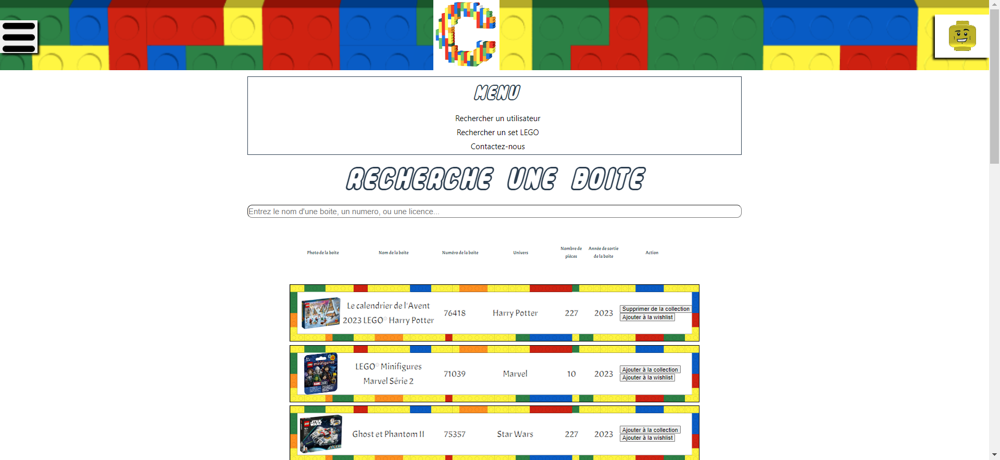

# Rechercher des boîtes sur notre site

Pour visualiser les différentes boîtes qu'il y a sur le site, vous pouvez accéder à la page "**RechercheBoite**"

## Comment visualiser l'ensemble des boîtes ?

<!--  -->

- Légende : Page permettant de rechercher une boîte dans la liste de boîte

Pour pouvoir visualiser l'ensemble des boîtes présent sur le site, il faut se rendre dans le menu en haut à gauche et appuyer sur le bouton "**Rechercher un set LEGO**". Une fois sur cette page, vous pouvez voir toute les boîtes sur le site.

## Comment rechercher une boîte précise ?

Pour pouvoir rechercher une boîte présente sur le site, il faut se rendre dans le menu en haut à gauche et appuyer sur le bouton "**Rechercher un set LEGO**". Une fois sur cette page une barre de recherche se trouve sur celle-ci et vous pouvez noter n'importe quelle information de la boîte. Cette manipulation permet de mettre à jour directement les boîtes qui s'affichent.

## Que faut-il renseigner dans la barre de recherche ?

Vous devez renseigner les informations suivantes dans la barre de recherche :

- Vous devez renseigner le numéro de la boîte souhaité.
- Vous devez renseigner le nom de la boîte souhaité.
- Vous devez renseigner le nombre de pièces de la boîte souhaité.
- Vous devez renseigner l'univers de la boîte souhaité.

L'ensemble de ces informations ne sont pas obligatoires dans la recherche et se font dans la même barre de recherche. Si aucune information ne se trouve dans la barre de recherche, cela affichera tous les utilisateurs.

### Des problèmes ?

- En cas de problème, vous pouvez :

1. Directement contacter l'administrateur en appuyant sur le bouton "**Contact**" sur le menu en bas du site
2. Vous renseignez dans la partie "Contacter l'administrateur" dans ce guide d'utilisateur
