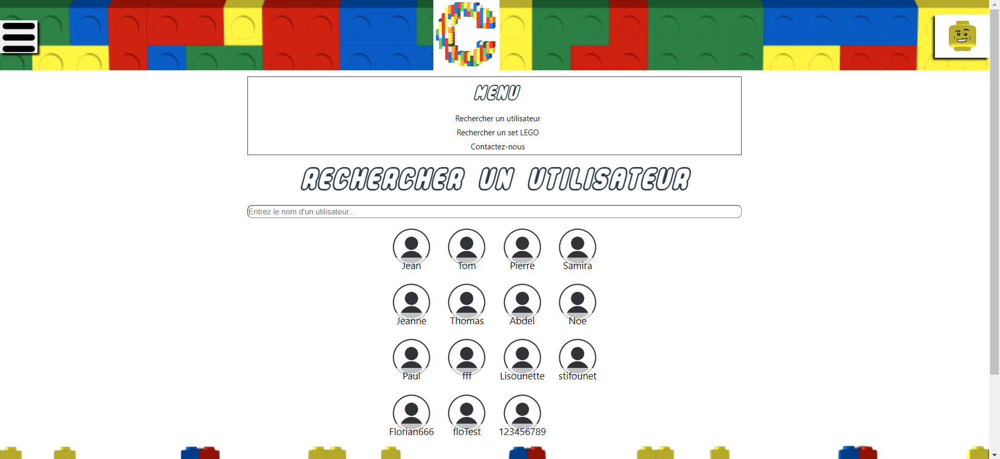

# Rechercher des utilisateurs sur notre site

Pour visualiser les différents utilisateurs qu'il y a sur le site, vous pouvez accéder à la page "**RechercheUtilisateur**"

## Comment visualiser l'ensemble des utilisateurs ?

<!--  -->

- Légende : Page permettant de rechercher un utilisateur dans la liste des utilisateurs

Pour pouvoir visualiser l'ensemble des utilisateurs présent sur le site, il faut se rendre dans le menu en haut à gauche et appuyer sur le bouton "**Rechercher un utilisateur**". Une fois sur cette page, vous pouvez voir tous les utilisateurs sur le site.

## Comment rechercher une utilisateur précise ?

Pour pouvoir rechercher un utilisateur présent sur le site, il faut se rendre dans le menu en haut à gauche et appuyer sur le bouton "**Rechercher un utilisateur**". Une fois sur cette page une barre de recherche se trouve sur celle-ci et vous pouvez noter le pseudo de l'utilisateur. Cette manipulation permet de mettre à jour directement les utilisateurs qui s'affichent.

## Que faut-il renseigner dans la barre de recherche ?

Vous devez renseigner le pseudo de l'utilisateur seulement, si rien n'est dans la barre de recherche cela met l'ensemble des utilisateurs du site.

### Des problèmes ?

- En cas de problème, vous pouvez :

1. Directement contacter l'administrateur en appuyant sur le bouton "**Contact**" sur le menu en bas du site
2. Vous renseignez dans la partie "Contacter l'administrateur" dans ce guide d'utilisateur
