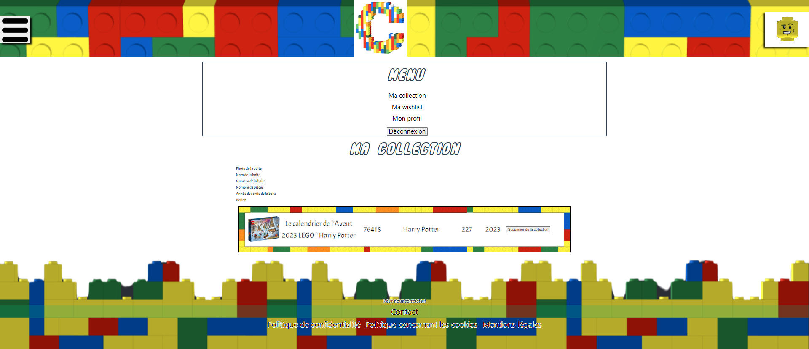

# Visualiser la Collection sur notre site

Pour pouvoir visualiser la Collection d'un utilisateur ou même la vôtre permet de voir chaque boîtes qu'il possède ou que vous possédez.

## Comment visualiser votre Collection ?

Pour pouvoir visualiser votre collection, il faut se rendre dans le menu en haut à droite et appuyer sur le bouton "**Collection**".

## Comment visualiser la Collection d'une autre personne ?

<!--  -->

- Légende : Page permettant de visualiser la collection d'un utilisateur

Pour pouvoir visualiser la Collection d'une autre personne, il faut se rendre dans le menu en haut à gauche et appuyer sur le bouton "**Recherche Utilisateur**", ensuite, il faut aller sur **le profil** de la personne souhaité.

## Près requis avant la visualisation de votre collection

Pour pouvoir visualiser votre collection, vous devez être connecté sur notre site.

### Des problèmes ?

- En cas de problème, vous pouvez :

1. Directement contacter l'administrateur en appuyant sur le bouton "**Contact**" sur le menu en bas du site
2. Vous renseignez dans la partie "Contacter l'administrateur" dans ce guide d'utilisateur
