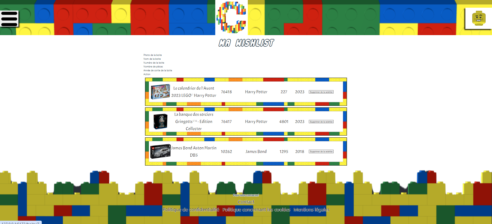

# Visualiser la Wishlist sur notre site

Pour pouvoir visualiser la Wishlist d'un utilisateur ou même la vôtre permet de voir chaque boîtes qu'il veut ou que vous voulez.

## Comment visualiser votre Wishlist ?

<!--  -->

- Légende : Page permettant de visualiser la wishlist d'un utilisateur

Pour pouvoir visualiser votre Wishlist, il faut se rendre dans le menu en haut à droite et appuyer sur le bouton "**Wishlist**".

## Comment visualiser la Wishlist d'une autre personne ?

Pour pouvoir visualiser la Wishlist d'une autre personne, il faut se rendre dans le menu en haut à gauche et appuyer sur le bouton "**Recherche Utilisateur**", ensuite, il faut aller sur **le profil** de la personne souhaité.

## Près requis avant la visualisation de votre Wishlist

Pour pouvoir visualiser votre Wishlist vous devez être connecté sur notre site.

### Des problèmes ?

- En cas de problème, vous pouvez :

1. Directement contacter l'administrateur en appuyant sur le bouton "**Contact**" sur le menu en bas du site
2. Vous renseignez dans la partie "Contacter l'administrateur" dans ce guide d'utilisateur
