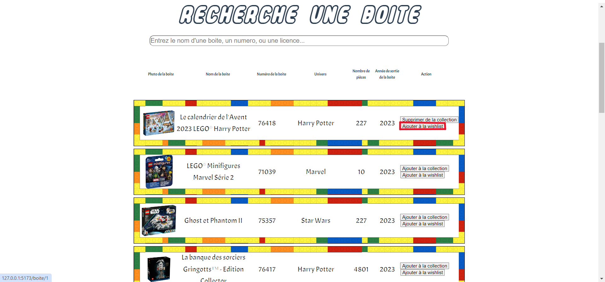
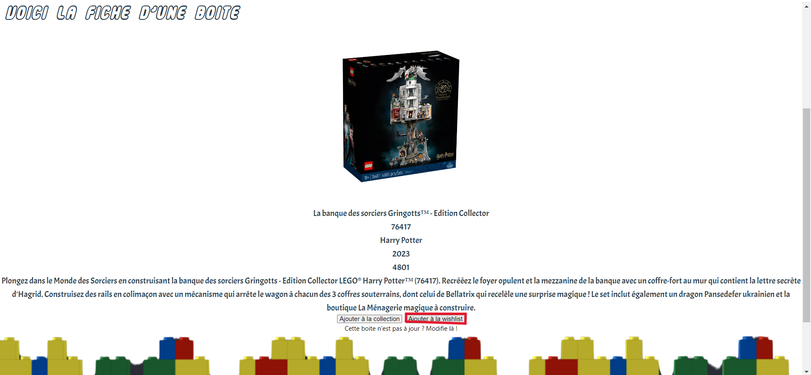

# Ajouter une boîte dans votre Wishlist sur notre site

Une fois connecter, vous pouvez gérer votre Wishlist en ajoutant des éléments dans celle-ci. Celle-ci est visible dans la vôtre Wishlist, elle se trouve dans le menu droit en cliquant sur le bouton "**Wishlist**".

## Comment ajouter une boîte dans la Wishlist ?

<!--  -->
- Légende : Boutton permettant d'ajouter une boîte sur ça wishlist dans la liste de recherche'

<!--  -->
- Légende : Bouton permettant d'ajouter une boîte dans sa wishlist sur la page de la boîte

Pour pouvoir ajouter une boîte dans la Wishlist, il faut se rendre dans **la page d'une boîte** que l'on veut ajouter ou sur la page **Recherche Boite** qui se trouve dans le menu gauche du site. Ensuite, il faut cliquer sur le bouton "**Ajouter dans la Wishlist**"

## Près requis avant votre ajout d'une boîte dans la Wishlist

Pour pouvoir avoir accès à la fonctionnalité d'ajout d'une boîte dans la Wishlist, vous êtes dans l'obligations d'être connecté sur notre site.

### Des problèmes ?

- En cas de problème, vous pouvez :

1. Directement contacter l'administrateur en appuyant sur le bouton "**Contact**" sur le menu en bas du site
2. Vous renseignez dans la partie "Contacter l'administrateur" dans ce guide d'utilisateur
