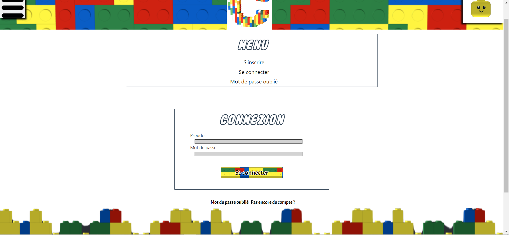

# Se connecter sur notre site

Pour pouvoir accéder à l'ensemble des fonctionnalités de notre site, il faut que vous vous inscrivez sur notre site, mais si jamais vous avez déjà un compte, vous pouvez tout simplement vous connecter.

## Comment se connecter ?

<!--  -->
- Légende : Page permettant de se connecter sur notre site'

Pour pouvoir se connecter, il faut se rendre dans le menu en haut à droite et appuyer sur le bouton "**Connexion**".

## Près requis avant votre connexion

Pour pouvoir avoir accès à l'ensemble des fonctionnalités du site, vous êtes dans l'obligation d'accepter l'ensemble des cookies nécessaires.
Si vous voulez plus d'information :

- Vous pouvez vous rendre sur la page concernant les cookies.
- Vous pouvez vous rendre directement sur les explications de la bannière sur ce guide d'utilisateur.

## Que faut-il renseigner sur la page de connexion ?

L'utilisateur doit renseigner quelques informations lorsqu'il veut se connecter sur notre site :

- Vous devez renseigner votre pseudo, celui que vous avez choisi pour vous connecter.
- Vous devez renseigner votre mot de passe d'une longueur dépassant 8 lettres/chiffres.

L'ensemble des informations sont dans l'ensemble des pages concernant les cookies et les politiques de confidentialités.

### Des problèmes ?

- Si jamais vous ne vous souvenez plus de votre mot de passe, vous pouvez :

1. Appuyer sur le bouton "**Mot de passe oublié**" dans le menu en haut à droite.
2. Appuyer sur le bouton "\*\*Mot de passe oublié ?" en dessous du formulaire de connexion.
3. Vous renseignez dans la partie "Changer son mot de passe" dans ce guide d'utilisateur.

- Si vous avez un autre problème, vous pouvez :

1. Directement contacter l'administrateur en appuyant sur le bouton "**Contact**" sur le menu en bas du site
2. Vous renseignez dans la partie "Contacter l'administrateur" dans ce guide d'utilisateur.
