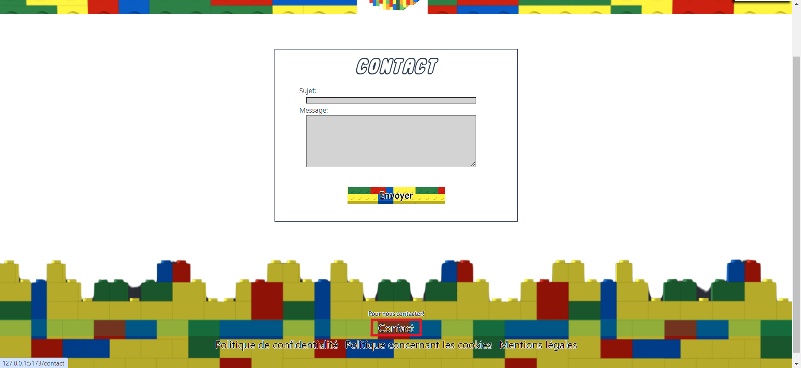

# Contacter l'administrateur sur notre site

Pour pouvoir contacter l'administrateur sur notre site permet de régler les différents problèmes, permet des remerciements ou tout autre chose.

## Comment Contacter l'administrateur ?

<!--  -->
- Légende : Page permettant de se connecter sur notre site'

Pour pouvoir Contacter l'administrateur, il faut se rendre en bas de la page et appuyer sur le bouton "**Contactez nous**".

## Que faut-il renseigner sur la page de contact ?

Vous devez renseigner quelques informations lorsque vous voulez nous contacter :

- Vous devez renseigner votre adresse mail.
- Vous devez renseigner le sujet du contact.
- Vous devez renseigner votre message envers l'administrateur.

### Des problèmes ?

En cas de problèmes à cette étape, vous pouvez nous contacter aux 06 XX XX XX XX.
