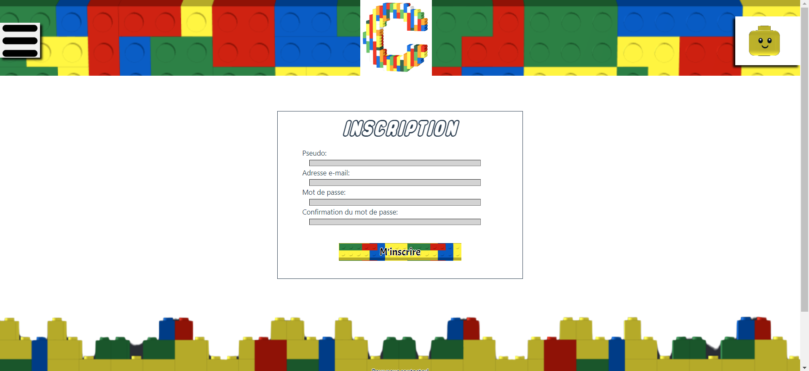
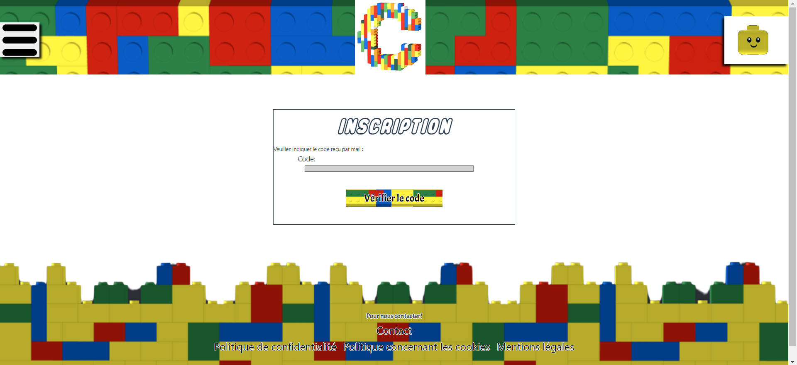

# S'inscrire sur notre site

Pour pouvoir accéder à l'ensemble des fonctionnalités de notre site, il faut que vous vous inscrivez sur notre site.

## Comment s'inscrire ?

<!--  -->
- Légende : Page permettant de s'inscrire sur notre site'

<!--  -->
- Légende : Page permettant de valiser le code reçu par mail

L'utilisateur peut s'inscrire de deux manières sur notre site :

- Il peut directement s'inscrire lorsqu'il est sur la toute première page en appuiyant sur le bouton centrale "**Rejoignez-nous**"
- Il peut s'inscrire en appuyant sur le bouton "**Inscription**" dans le menu en haut à droite.

## Près requis avant votre inscription

Pour pouvoir avoir accès à l'ensemble des fonctionnalités du site, vous êtes dans l'obligation d'accepter l'ensemble des cookies nécessaires.
Si vous voulez plus d'information :

- Vous pouvez vous rendre sur la page concernant les cookies.
- Vous pouvez vous rendre directement sur les explications de la bannière sur ce guide d'utilisateur.

## Que faut-il renseigner sur la page d'inscription ?

L'utilisateur doit renseigner quelques informations lorsqu'il veut s'inscrire sur notre site :

- Il doit renseigner un pseudo, ce n'est pas obligatoirement son prénom, son nom ou autre chose qui l'identifie.
- Il doit rensigner son adresse mail afin de pouvoir profiter de fonctionnalité.
- Il doit renseigner un mot de passe d'une longueur dépassant 8 lettres/chiffres.

L'ensemble des informations sont dans l'ensemble des pages concernant les cookies et les politiques de confidentialités.
