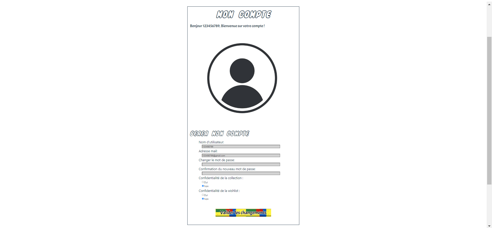

# Modifier les informations du profil sur notre site

Cette fonctionnalité permet de modifier les différentes informations de votre profil.

## Comment modifier les informations du profil ?

<!--  -->
- Légende : Page permettant de modifier vos informations utilisateur'

Pour pouvoir modifier les informations du profil, il faut se rendre dans le menu en haut à droite et appuyer sur le bouton "**Profil**". Vous pourrez changer chaque information sur cette page. Après avoir changé les informations, il faudra se connecter de nouveau.

## Près requis avant la modification de vos informations

Pour pouvoir modifier vos information, vous êtes dans l'obligations d'être connecté sur notre site.

## Que faut-il renseigner sur la page de modification de votre profil ?

Vous devez renseigner quelques informations lorsque vous voulez modifier vos informations :

- Vous devez renseigner votre nouveau pseudo.
- Vous devez renseigner votre nouvelle adresse mail.
- Vous devez renseigner votre nouveau mot de passe.
- Vous devez renseigner si vous voulez que votre Collection soit privée ou non.
- Vous devez renseigner si vous voulez que votre Wishlist soit privé ou non.

L'ensemble des informations ne sont pas obligatoires si vous voulez les garder.

### Des problèmes ?

- En cas de problème, vous pouvez :

1. Directement contacter l'administrateur en appuyant sur le bouton "**Contact**" sur le menu en bas du site
2. Vous renseignez dans la partie "Contacter l'administrateur" dans ce guide d'utilisateur.
